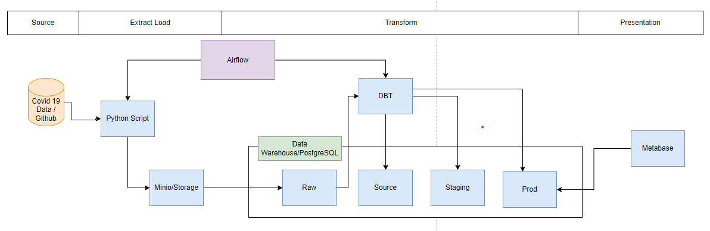
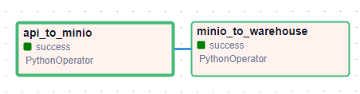
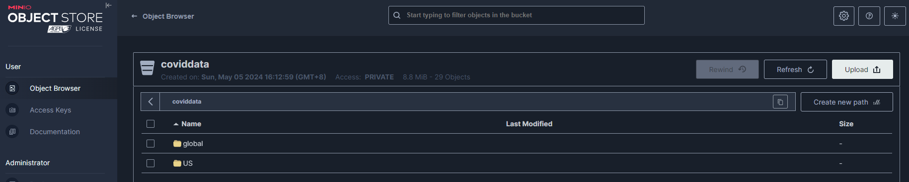
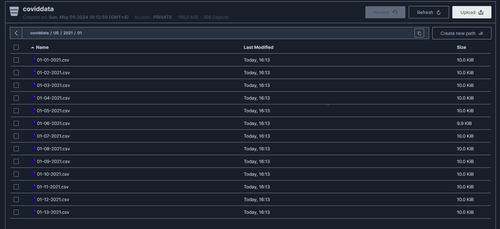
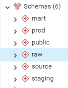
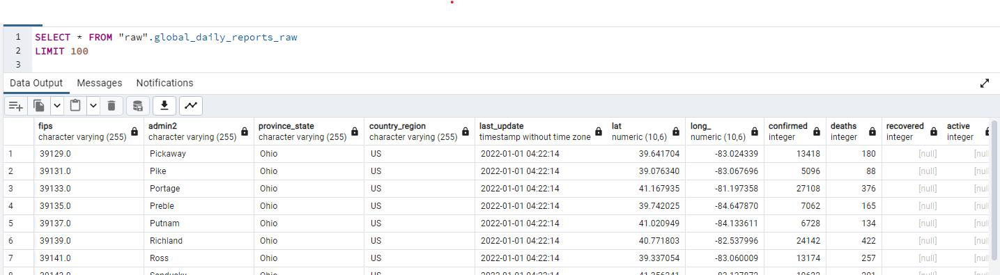
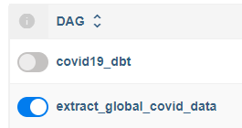
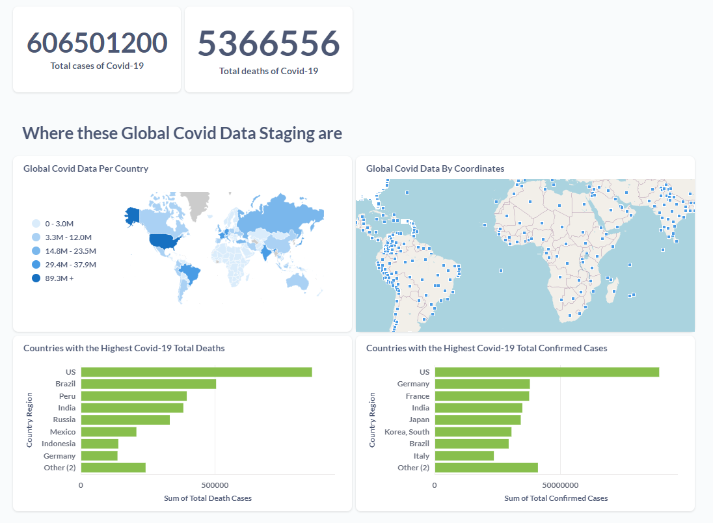
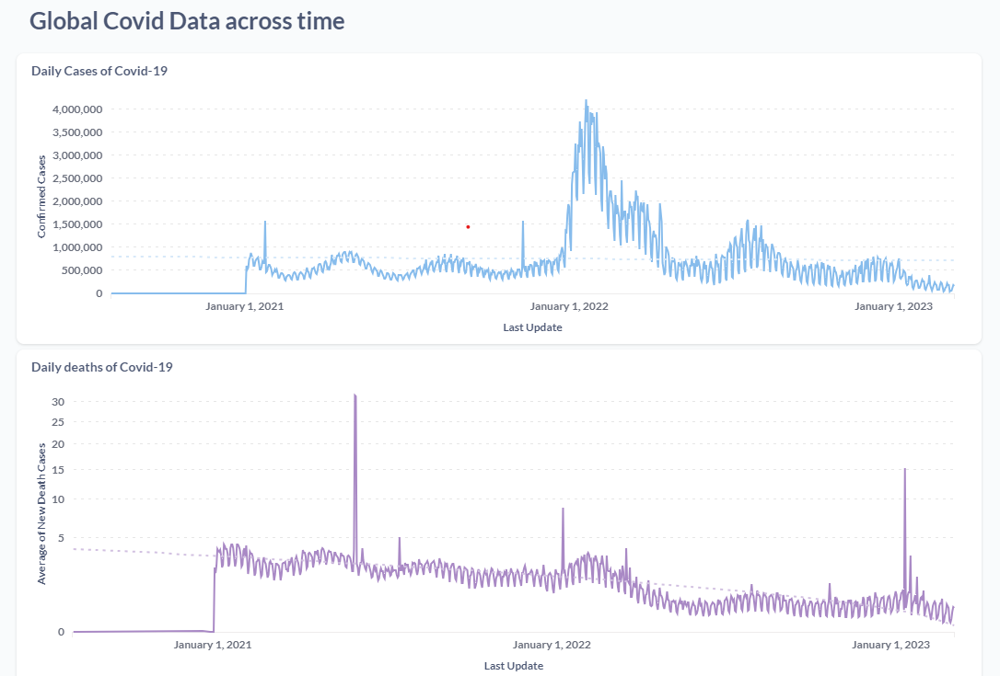

# Analyzing Covid-19 Data

## Project Overview
This project outlines an Extract, Transform, Load (ETL) pipeline for processing Covid19 data using Dockerized infrastructure. The pipeline is orchestrated by Apache Airflow, with Postgresql for metadata storage and warehouse, dbt for data transformation, and Minio for data storage.

## Infrastructure Overview

Docker Compose will be utilize to manage our infrastructure, which consists of the following services:

- **Airflow**: A platform to programmatically author, schedule, and monitor workflows. It will orchestrate the ETL process.
  
- **PostgreSQL**: PostgreSQL is now both the backend of Airflow and the data warehouse. It will handle metadata related to the ETL process, task statuses, execution dates, and serve as the central repository for analytics data. (Note: For ideal deployment, the airflow-backend and the data warehouse should be separated. But for this demo, it will be served both.)
  
- **Minio**: An open-source object storage server compatible with Amazon S3 API. It will serve as the initial destination of the extracted data.

- **dbt (Data Build Tool)**: dbt works directly with the data in the warehouse, making it easy to build, test, and deploy data transformation pipelines. It allows for the creation of modular, version-controlled SQL transformations, and promotes code reusability and collaboration among team members.

- **Metabase**: Metabase is an open-source business intelligence and analytics tool. It provides a simple interface for users to generate and share insights from their data. Metabase can connect to various data sources, including MySQL and Minio, allowing users to create visualizations, dashboards, and run ad-hoc queries on the data stored in these sources. It will provide a user-friendly interface for data exploration and reporting on the extracted and transformed data from your ETL process.

## Setup Instructions
1. Clone the repository from GitHub:
2. Install Docker and Docker Compose if not already installed on your system.
3. Navigate to the project directory.
4. Build the Docker containers using `docker-compose build`.
5. Start the services with `docker-compose up`.

**Note**: For simplicity's sake, the credentials are stored in a `.env` file. **This should be avoided in production.** Instead, consider using a more secure method for managing secrets, such as AWS Secrets Manager.

## Execution Instructions
1. Access the Airflow web interface at `http://localhost:8080` (Use `Username`: `airflow` and `Password` : `airflow`).
2. Turn on first the DAG for `extract_global_covid_data`.
3. Monitor the workflow execution and view task statuses in the Airflow UI.

7. Access the Minio dashboard at `http://localhost:9001` to verify data storage.

8. Access PostgresSQL using `Username: root, Password: admin` to interact with the db storage. There's an `postgresql/init.sql`  that is used to initialize the PostgreSQL database when the container starts up. It contains commands creating tables and schemas.

9. Back to Airflow, turn on the `covid19_dbt` to perform the transformations.

## Insights
Extraction: 
- I visited the provided URL and identified the dataset containing the covid19 data. When I check the URL, it shows a csv file.
- The URL format allows for easy dynamic changes, facilitating dynamic data extraction.
- Utilizing direct download methods, I created a python-script to get the data by utilizing its dynamic file naming.

Loading and Cleaning: 
- Once the data have been obtained, I loaded it first to a storage. In this particular instance, I used Minio as a staging layer.
- Note: For production, I'll highly suggest cloud storage such as google cloud storage or AWS S3
- Once the data is in staging layer, I loaded it to a dataframe and push push it to postgresql (acting as a warehouse).
- Note: For production, I'll highly suggest AWS Redshift for data warehousing.

Transformations:
- I leverage dbt to handle data transformations primarily within SQL, ensuring that the visualization focuses on presenting insights rather than complex data processing.
- This is also very useful in saving queries. Rather than crafting queries directly in the presentation layer, they can be generated and stored within dbt, streamlining the process and enhancing organization.
- *Raw Data* : Data loaded “as is” from source. It could be a production database, API,  analytics or any other data source. This data shouldn’t be used directly in reports. It should go first trough staging data stage
- *Source Data* : Rename fields to user-friendly names. Minimal transformations that are 100% guaranteed to be useful for the foreseeable future.
- *Staging Data* : Clean and organized version of Source Data. It will be used to build Data Marts.
- *Marts* : Models describe business entities and processes.

Aggregation and Visualization: 
- With the clean data loaded into the database, I performed aggregation to calculate the highest number of cases for confirmed/deaths.
- Using SQL queries, I performed some data manipulation so that I can track the changes by day for confirmed, active, deaths, and recovered.

## Data Analysis: COVID-19 in the World

As can be seen from the summary, the count of total cases of COVID-19 in the World reported from 2020-Jan-04 to 2023-March-10 was 606.5 millions. The total death was about 5.3 million (or 0.88% of the cases).

The leading countries in total cases:
| Country      | Total Cases (in millions) |
|--------------|---------------------------|
| United States| 89.282                    |
| Germany      | 37.869                    |
| France       | 37.587                    |
| India        | 34.880                    |
| Japan        | 34.238                    |

The leading countries in death cases:
| Country      | Total Cases               |
|--------------|---------------------------|
| United States| 862,59                    |
| Brazil       | 504,533                   |
| Peru         | 395,055                   |
| India        | 382,367                   |
| Russia       | 331,813                   |

As we can see, at the beginning of 2022, we had an sudden growth in the total number of cases. However, as we can see from the trendline from the `Daily deaths of Covid-19`, the overall trend is going down and the increase in deaths began to slow along 2022.

### Conclusion
The summary shows that between January 2020 and March 2023, the world had a huge number of COVID-19 cases, reaching over 600 million, causing around 5.3 million deaths. The United States had the most cases and deaths, followed by countries like Germany, France, Brazil, and India. Although there was a sharp increase in cases at the start of 2022, the graph of daily deaths indicates a downward trend, suggesting that the situation gradually improved over time.
